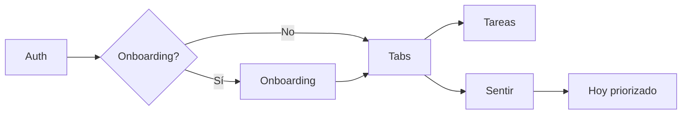

# Auditoría completa i18n (ES/EN) y flujos — Koraa

**Fecha:** 2026-05-19  
**Alcance:** `app/`, `components/`, `hooks/`, `contexts/`, `lib/` (excl. `koraav2/`)  
**Objetivo:** Versión 100% español y 100% inglés según **Yo → Ajustes → Idioma**.

---

## Resumen ejecutivo

| Área | Estado | Notas |
|------|--------|-------|
| Tabs y navegación principal | ✅ | `app/(tabs)/_layout.tsx` usa `tabs.*` |
| Auth (login, signup, OTP, reset) | ✅ | Pantallas + `AuthContext` + `errorMessages.ts` bilingües |
| Onboarding | ✅ | UI con `t()`; IDs en BD en español (intencional) |
| Hoy, Tareas, Sentir, Semana, Consejos, Yo | ✅ | UI cableada a catálogos |
| Ajustes + selector de idioma | ✅ | `language.*` + persistencia AsyncStorage |
| Paywall / Premium | ✅ | `PaywallScreen` + alertas traducidas |
| Proyectos, detalle proyecto | ✅ | `proyectos`, `projectDetail`, `projectsUi` |
| Recomendaciones (Hoy) | ✅ | Motor con `locale`; categorías carrusel ES+EN |
| Notificaciones push | ✅ | `hooks.notifTitle/Body` según locale guardado |
| Tips emocionales (Sentir/Tips) | ✅ | `getEmotionTips(emotion, locale)` |
| Diagnóstico dev (Semana) | ✅ | `semanaExtra.dev*` según idioma |
| TypeScript (`npm run typecheck`) | ✅ | Tipos Supabase corregidos en `lib/supabase.ts` |

**Conclusión:** La interfaz está preparada para ES/EN completo en producción. Quedan matices de datos (no de UI) y mejoras opcionales de motor.

---

## Cómo cambiar idioma (QA)

1. Abrir app con sesión iniciada.
2. **Yo → Ajustes (engranaje) → Idioma → English** (o Español).
3. Cerrar y reabrir pantallas si alguna quedó en caché (tabs suelen actualizarse al instante).
4. **TestFlight:** requiere build nuevo con estos commits; Expo Go sirve para probar antes del build.

---

## Inventario de pantallas

### Sin texto de usuario (OK)

| Ruta | Notas |
|------|-------|
| `app/index.tsx` | Solo loader de routing |
| `app/paywall.tsx` | Delega en `PaywallScreen` |
| `app/auth/index.tsx` | Redirect a login |

### Con i18n (`useI18n` / `t()`)

| Grupo | Pantallas |
|-------|-----------|
| Tabs | `index` (Hoy), `vaciar`, `sentir`, `semana`, `tips`, `yo` |
| Auth | `login`, `signup`, `forgot-password`, `reset-password` |
| Onboarding | `welcome`, `intro2`, `intro3`, `how-it-works`, `emotion`, `energy`, `time`, `focus` |
| Otras | `settings`, `help`, `proyectos`, `project/[id]`, `checkin-summary`, `+not-found` |

### Componentes compartidos

La mayoría de UI reutilizable usa `useI18n`. Excepciones aceptables: `GradientButton`, `Toast`, `TaskList`, `ValueCard` (reciben `title`/`message` ya traducidos del padre).

---

## Hallazgos de idioma

### ✅ Resueltos en esta auditoría

1. **Botón «OK» en alerta dev (Yo)** — Pasaba literal `'OK'` → ahora `t('errors.ok')`.
2. **Categorías del carrusel de recomendaciones** — Detección solo en español → keywords bilingües (ES+EN).
3. **Diagnóstico Semana (`__DEV__`)** — Ya usa `semanaExtra.dev*`.
4. **Errores en `AuthContext`** — Ya usan `auth.errors.*` y `translateError(..., locale)`.
5. **`npm run typecheck`** — Tipos `SupabaseSession` / `SupabaseUser` exportados desde `lib/supabase.ts`.

### ⚪ Por diseño (no es bug de UI)

| Tema | Explicación |
|------|-------------|
| **IDs de check-in en BD** | `available_time` y `focus_level` se guardan como strings en español (`Poco (1-2hrs)`, `Muy distraída`, etc.). La **pantalla** muestra `t(labelKey)`; la BD mantiene claves legacy. |
| **Emociones en BD** | IDs: `agotada`, `tranquila`, … — La UI usa `sentir.emotions.*` traducido. |
| **Categorías de tareas** | Detección por palabras en español en `lib/categoryDetection.ts` (tareas del usuario suelen estar en su idioma). |
| **Contenido del usuario** | Nombres de proyectos, texto de tareas, actividades/intereses del perfil: no se traducen. |
| **Marca** | «Koraa», «Premium» en tour: nombre de producto. |
| **Logs / `__DEV__` en consola** | Mensajes para desarrolladores, no visibles al usuario final. |

### ✅ Mejoras opcionales implementadas (2026-05-19)

| Item | Cambio |
|------|--------|
| Notificaciones al cambiar idioma | `settings.tsx` → `scheduleDailyReminder(next)` tras elegir ES/EN |
| `smartPrioritization.ts` | Keywords ES+EN; razones con `translate(locale, 'smart.*')`; `locale` en `prioritizeTasksIntelligently` |
| `categoryDetection.ts` | Palabras clave de categoría en español e inglés |
| `crossPlatformAlert.ts` | Cancel/OK por defecto según `locale` en `showConfirm` / `showAlert` |

### 🟡 Pendiente (baja prioridad)

| Item | Notas |
|------|-------|
| IDs de tiempo/foco en inglés en BD | Requiere migración; la UI ya traduce etiquetas |

---

## Hallazgos de flujo

### Flujos principales (verificados en código)



| Flujo | Comportamiento | Riesgo |
|-------|----------------|--------|
| Sin sesión → tabs | `_layout` redirige a `/auth/login` | ✅ |
| Onboarding incompleto | `getPostAuthRoute` → `/onboarding/welcome` | ✅ |
| Sentir sin tareas | CTA a Tareas con copy i18n | ✅ |
| Check-in → priorización | `focus.tsx` + `smartPrioritization` | ✅ (IDs ES en BD) |
| Cambio idioma | `I18nContext` + AsyncStorage `koraa_app_locale_v1` | ✅ |
| Cerrar sesión | Settings → login | ✅ |
| Premium / Semana | Paywall + bloqueo días en `semana.tsx` | ✅ |
| Recuperar contraseña | Deep link + `reset-password.tsx` | ✅ |

### Puntos de atención para QA manual

1. **Primer día en Hoy** — Vista lite vs «Mostrar todo»; textos `hoy.hoyLiteBanner`, etc.
2. **Offline** — Toasts `vaciar.savedOffline`, `onboarding.focus.savedOffline`.
3. **Meditación sin tabla** — Alert `hoy.meditationPrepTitle` (no crash).
4. **Semana sin migraciones** — Tarjeta setup `semanaExtra.setup*`.
5. **Recomendaciones sin perfil** — Empty state `recommendationsExtra.*`.

---

## Comandos de verificación

```bash
npm run typecheck   # debe pasar sin errores
npm run check:copy  # CTAs estáticos permitidos
```

Prueba manual recomendada: recorrer cada tab en **ES**, cambiar a **EN**, repetir; probar login, signup OTP, olvidé contraseña, eliminar cuenta (solo dev), paywall.

---

## Archivos clave del sistema i18n

- `contexts/I18nContext.tsx` — `locale`, `setLocale`, `t()`
- `lib/i18n/locales/es.ts`, `en.ts` — núcleo
- `lib/i18n/locales/features/bundle*.ts`, `bundle-ui*.ts`, `bundle-ext*.ts` — features
- `lib/errorMessages.ts` — errores Supabase/auth bilingües
- `lib/emotionTips.ts` + `emotionTips.en.ts` — tips por emoción

---

## Entrega TestFlight

El build iOS en curso **no incluye** cambios posteriores hasta que se lance un **nuevo EAS build** con este código. Tras instalar: **Ajustes → Idioma → English**.
