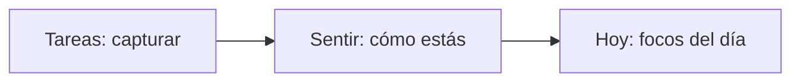

# Flujo inspirado en Musa — adaptado a Koraa

**Fecha:** 2026-06-04  
**Estado:** P0 parcial + mapa de tabs acordado (2026-06-04)

---

## Mapa Koraa ↔ Musa (decisión de producto)

| Musa | Koraa | Qué hace |
|------|-------|----------|
| **Inicio** — registrar periodo + síntomas + texto de fase | **Hoy** — check-in emocional + tareas del día + tip según emoción | Ritual diario en **una sola tab** (sin modal obligatorio) |
| **Mi ciclo** — calendario por fases | **Calendario** (tab Semana) — tareas por día, vista calendario | Ver todo lo pendiente por fecha |
| **Para mí** — historial + gráficos bloqueados | **Yo** (evolución) — historial + **patrones Premium** | Insights; desbloqueo con suscripción |
| **Tips** | **Consejos** | Se mantiene |
| **Perfil** | **Yo** — ajustes y cuenta | Se mantiene |

**Tareas** (captura / brain dump) sigue como tab aparte para vaciar la mente; en **Hoy** se ven las tareas del día y enlace rápido a agregar.

**No copiamos:** morado oscuro, dragón, ciclo menstrual.

---

## Implementado en código (2026-06-04)

- **`HoyInicioView`**: hero tipo Musa (orbe + pill blanca), tarjeta de contexto, emojis circulares, slider, preview de tareas — todo en tab Hoy sin FlowIndicator.
- Tab **Semana** renombrada a **Calendario** (i18n).
- Check-in modal `/sentir` sigue para actualizar desde otros sitios.

**Pendiente:** ~~calendario visual en Semana (P2)~~, ~~patrones Premium en Yo (P3)~~ — ver [2026-06-04_musa_p3_yo_para_mi.md](../delivered/2026-06-04_musa_p3_yo_para_mi.md).

---

## Decisión de producto (2026-06-04)

**Koraa no incluirá seguimiento de ciclo menstrual.**

- El check-in refleja **cómo te sientes hoy** (vida, energía, contexto), no fases hormonales.
- Inspiración Musa = **simplicidad visual y ritual corto**, no calendario de periodo ni mascota de ciclo.
- La vista **Semana** (si se mejora) usa color por **emoción/energía del check-in**, no por fase lútea/folicular.

---

## Qué hace Musa bien (y qué **no** copiamos)

| Patrón Musa | Por qué funciona | Adaptación Koraa |
|-------------|------------------|------------------|
| **Un foco por pantalla** | Emoción + energía en un solo paso visual | Check-in unificado en Sentir (no 4 pantallas seguidas para el ritual diario) |
| **Hero + una acción principal** | Huevo + «Registrar periodo» = claridad | Hoy sin check-in: hero + **«Ir a Sentir»** (no 5 CTAs compitiendo) |
| **Sliders con etiqueta viva** | «Neutral» bajo el control = feedback inmediato | Slider de energía + emoción elegida visible |
| **Calendario con color = significado** | Fases del ciclo legibles al instante | Semana: días coloreados por **emoción/energía** (no por ciclo menstrual) |
| **Mascota / 3D** | Vínculo emocional | **No** dragón ni culpa («sin comida»). Koraa: halo/gradiente + copy calmado ([voz](../delivered/2026-05-05_koraa_voice_and_microcopy_guide.md)) |
| **Modal al saltar ritual** | Reduce abandono del hábito | Modal Koraa: «Un minuto en Sentir ordena tu Hoy» — tono compasivo, salida clara |
| **Tema oscuro morado** | Identidad Musa | Koraa mantiene **claro + gradiente azul/rosa** (ya definido en `THEME`) |

---

## Flujo objetivo Koraa (3 pasos, como Musa pero con producto Koraa)

1. **Tareas** — brain dump rápido (ya existe `vaciar`).
2. **Sentir** — **una pantalla visual**: «¿Cómo te sientes?» → emoción + energía → opcional tiempo/enfoque en sheet corto o valores por defecto inteligentes.
3. **Hoy** — lista priorizada; sin tarjetas duplicadas de «cómo funciona» (ya retirada en build 28).

---

## Fases de implementación

### P0 — Claridad inmediata (recomendado primero)

| Entrega | Pantalla | Cambio |
|---------|----------|--------|
| **Check-in visual** | `Sentir` | Modal o pantalla full-bleed con gradiente, burbuja «¿Cómo te sientes?», rejilla emociones compacta, **slider de energía** (1–5), botón **Continuar** → guardar o paso corto tiempo/foco |
| **Hoy hero** | `Hoy` | Si no hay check-in: bloque hero (gradiente) + CTA único **«Hacer check-in»** → Sentir |
| **FlowIndicator** | Tabs | Mantener arriba; es el «mapa» tipo Musa sin repetir tarjeta larga |

**Archivos probables:** `components/sentir/SentirVisualCheckIn.tsx`, `app/(tabs)/sentir.tsx`, `app/(tabs)/index.tsx`, i18n `bundle*.ts`.

### P1 — Ritual y retención (tono Koraa)

| Entrega | Cambio |
|---------|--------|
| Modal al salir de Sentir sin guardar | Copy: «¿Te vas? Hoy se adapta mejor si nos dices cómo estás.» CTAs: **Seguir check-in** / **Ahora no** |
| Tras check-in | Micro-celebración (toast suave) + navegación a Hoy |

### P2 — Vista semanal visual (tipo calendario Musa)

| Entrega | Cambio |
|---------|--------|
| `semana.tsx` | Calendario mensual/semanal con **color por emoción** + leyenda (como fases Musa pero = estados emocionales) |
| FAB o barra inferior | «Check-in hoy» si falta registro |

### P3 — Profundidad (opcional / Premium)

| Entrega | Cambio |
|---------|--------|
| «Para mí» / Consejos | Tarjetas con mini-gráficos (ánimo / energía) estilo Musa «Tu estado de ánimo» |
| Yo | Header con progreso de racha más visual (anillo, no solo número) |

---

## Principios de diseño Koraa (vs Musa)

1. **Misma simplicidad, otra estética:** fondos claros, `THEME.colors.gradient`, sombras suaves — no clonar morado oscuro.
2. **Un CTA dominante por contexto** (regla de voz Koraa).
3. **Check-in ≤ 60 s:** emoción + energía obligatorios; tiempo/foco con defaults («Lo que tengas» / «Equilibrado») o segundo sheet de 2 taps.
4. **Sin culpa:** nada de «me dejas sin comida»; sí «tu día puede sentirse más liviano».
5. **Accesibilidad:** sliders con `accessibilityValue`, contraste en `metaOnFill` (ya en build 28+).

---

## Criterios de éxito (TestFlight)

- [ ] Usuario nuevo entiende en < 10 s: Tareas → Sentir → Hoy (sin leer párrafo largo).
- [ ] Check-in diario se completa en una pantalla principal (+ opcional sheet corto).
- [ ] Hoy sin check-in muestra **un** camino claro, no scroll de explicaciones.
- [ ] Copy pasa checklist de voz Koraa (ES/EN).

---

## Siguiente paso

Implementar **P0** en rama dedicada → build **1.0.4** cuando UX esté validada en Expo Go.

**Relacionado:** [koraa_ux_flow_audit.md](../delivered/koraa_ux_flow_audit.md), [2026-05-05_koraa_voice_and_microcopy_guide.md](../delivered/2026-05-05_koraa_voice_and_microcopy_guide.md)
